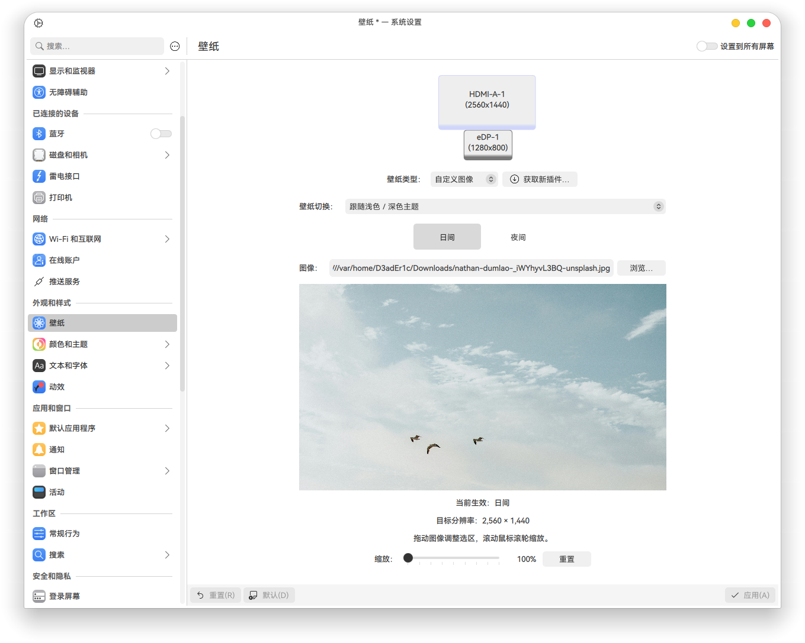
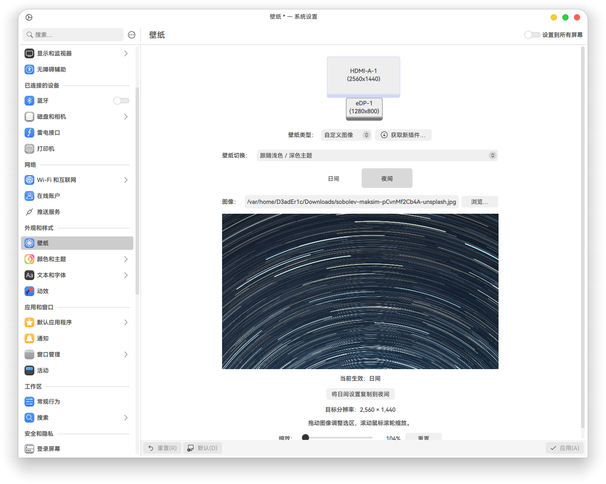

# Custom Image

A KDE Plasma wallpaper plugin with customizable framing, zoom, independent day/night profiles, and per-display settings.

## Screenshots

<p align="center">
  
  
</p>


## Features

- **Custom framing:** drag the preview to choose the visible image area without modifying the source file.
- **Zoom controls:** adjust from 100% to 300% in 1% steps, with mouse wheel support.
- **Proportional previews:** preview your wallpaper at the target display's aspect ratio, including portrait and ultrawide layouts.
- **Independent day/night profiles:** choose separate images, zoom levels, and framing for each variant.
- **Automatic switching:** follow the system day/night cycle or light/dark appearance, or keep either variant active.
- **Per-display persistence:** save profiles by connector name and restore saved settings when displays disconnect or reconnect.


## Requirements

- KDE Plasma **6.7** and Qt 6.
- Plasma's image wallpaper QML components and KCMUtils.


The development target is Fedora Kinoite 44 with Plasma 6.7.5. Compatibility with other Plasma versions has not been verified.

## Installation

```sh
git clone https://github.com/D3adEr1c/plasma-custom-bg.git
cd plasma-custom-bg
./install.sh
```

The installer copies the plugin and the compiled Simplified Chinese translation. The default plugin location is:

```text
~/.local/share/plasma/wallpapers/org.liby0zud.customimage
```

If `XDG_DATA_HOME` is set, its corresponding location is used instead.

In **Wallpaper Setting**, select **Custom Image** as the wallpaper type.

### Updating

Close wallpaper settings before installing an update. After installation, **close System Settings, log out, and log back in** so Plasma reloads the QML and configuration schema. Reopening Settings alone may leave the old schema loaded.

## Usage

1. Open wallpaper settings for the display you want to configure.
2. Choose a switching mode.
3. On the **Day** tab, select an image, drag to frame it, and adjust zoom using the slider or mouse wheel.
4. On the **Night** tab, configure the night image, framing, and zoom.
5. Click **Apply** to save both profiles and the switching mode.

The tabs select the variant being edited and previewed. They do not change the desktop's switching mode.

If no night image is selected, the night variant uses the complete day profile, including zoom and framing. **Reset** resets only the current tab's zoom and framing.

Images are referenced at their original paths. Keep the source files available; the plugin does not copy them.

### Switching modes

| Mode | Behavior |
| --- | --- |
| Follow system day/night cycle | Use Plasma's scheduler, switching halfway through the sunrise or sunset transition. |
| Follow light/dark theme | Select a profile based on the system application appearance. |
| Always day | Keep the day profile active. |
| Always night | Keep the night profile active, falling back to day if no night image is selected. |


### Preview behavior

The preview uses target dimensions supplied by the wallpaper configuration host, or the desktop wallpaper item's dimensions when available.

If automatic detection is unavailable, **Preview screen** lets you select a display for previewing. This selection affects only the preview; Plasma's wallpaper settings window determines where Apply writes the configuration. If no valid dimensions are available, the plugin shows a labeled temporary 16:9 preview.

## Multiple displays and configuration

Profiles are keyed by connector names such as `HDMI-A-1` and `eDP-1`, rather than positions in the screen list.

Records are stored in:

```text
~/.config/custom-image-wallpaper.ini
```

The file is stored under `XDG_CONFIG_HOME` instead when that variable is set. Back up this file to preserve your profiles; back up the image files separately.

INI sections and keys:

```ini
[Display-HDMI-A-1]
FormatVersion=2
TargetOutput=HDMI-A-1
Image=file:///home/user/Pictures/day.png
Zoom=1.5
FocusX=0.5
FocusY=0.5
NightImage=file:///home/user/Pictures/night.png
NightZoom=1.2
NightFocusX=0.5
NightFocusY=0.5
SwitchMode=1
ScheduleState=
ProfileRevision=1790832000000
```

`SwitchMode` values 
- `0` for the system day/night cycle, 
- `1` for light/dark appearance,
- `2` for always day,
- `3` for always night.

`ProfileRevision` identifies newer settings.

Keep the relevant displays connected when initially establishing their records. Previously lost settings cannot be reconstructed if no saved record exists; configure that display once to create one.

**Identity scope:** profiles follow connector names, not hardware serial numbers. Moving a monitor to another connector uses that connector's profile. Profiles are shared across Plasma activities on the same connector.


## Uninstallation

First switch every display and activity to another wallpaper type and apply the change. Then remove the plugin and translation:

```sh
rm -rf -- "${XDG_DATA_HOME:-$HOME/.local/share}/plasma/wallpapers/org.liby0zud.customimage"
rm -f -- "${XDG_DATA_HOME:-$HOME/.local/share}/locale/zh_CN/LC_MESSAGES/plasma_wallpaper_org.liby0zud.customimage.mo"
```

To permanently delete profile:

```sh
rm -f -- "${XDG_CONFIG_HOME:-$HOME/.config}/custom-image-wallpaper.ini"
```

## Development

JavaScript regression tests require Node.js:

```sh
for test in tests/*.cjs; do
    node "$test" || break
done
```

Qt tests require Python 3 and `PySide6-Essentials`:

```sh
python3 tests/qml-ui.py
python3 tests/theme-state.py
python3 tests/output-store.py
```

Tests cover preview geometry, zoom input, day/night selection, system appearance, bidirectional copying, configuration restoration, cancelled edits, persistence across processes, and legacy format migration.

Some Qt tests use stand-ins for KDE services. **Actual Plasma hotplug behavior, the native day/night scheduler, and DBus Apply still require desktop integration testing.**

When reporting an issue, include the plugin, Plasma, and Qt versions, connector names, switching mode, and steps to reproduce it.

## LICENSE
### Code
MIT license

### Screenshots

Under [unsplash license](https://unsplash.com/license)

day: [image link](https://unsplash.com/photos/three-birds-fly-over-a-hazy-calm-ocean-_iWYhyvL3BQ)

night: [image link](https://unsplash.com/photos/circular-star-trails-against-a-dark-blue-sky-pCvnMf2Cb4A)
